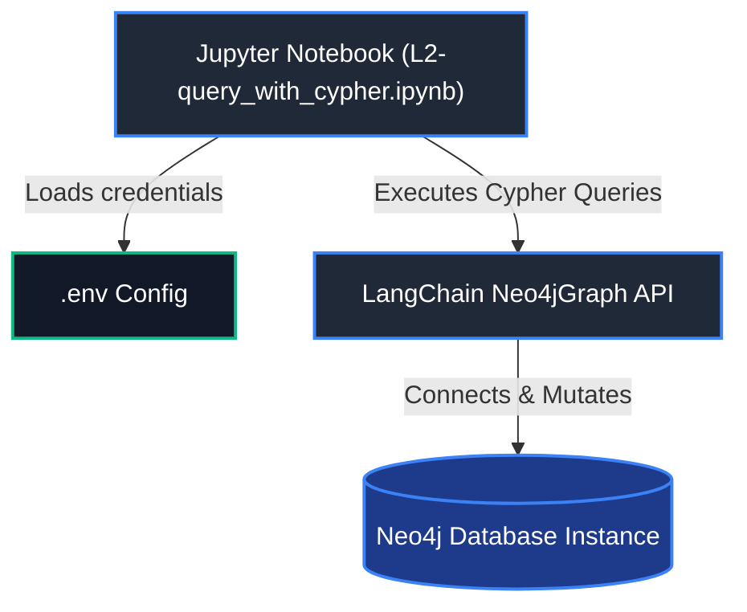

# Knowledge Graph for RAG (Deeplearning.AI)

This project contains practical lessons and exercises from the **Knowledge Graphs for RAG** course by Deeplearning.AI. The main objective of this project is to learn about graph databases and how to leverage them in a Retrieval-Augmented Generation (RAG) pipeline to improve retrieval efficiency, maintain semantic context, and reduce LLM query costs.

---

## 🗺️ Component & Directory Mapping

Here is the structure of the project repository:

### 1. Jupyter Notebooks
* **Directory:** `.` (Root)
* **Purpose:** Contains interactive python notebooks demonstrating knowledge graph queries and integration.
* **Key Files:**
  - `L2-query_with_cypher.ipynb`: Demonstrates how to connect to a Neo4j database using LangChain, query the movie knowledge graph with the Cypher query language (filtering, relationship matching, aggregation), and modify database records (creating, merging, and deleting nodes/relationships).

---

## 🏗️ System Architecture

The following diagram illustrates how the Python runtime, LangChain integration layer, and the Neo4j Graph Database communicate:



---

## 🚀 Getting Started & Installation

Follow these steps to set up and run this project locally.

### Prerequisites
- Python >= 3.9
- Neo4j Database (e.g., a local Neo4j Desktop instance, Docker container, or Neo4j AuraDB instance)
- Jupyter Notebook / JupyterLab or VS Code with Jupyter extension

### Installation Steps

1. **Clone the repository:**
   ```bash
   git clone <repo_url>
   cd Knowledge_graph_for_Rag
   ```

2. **Create and activate a virtual environment:**
   ```bash
   # Create environment
   python -m venv venv

   # Activate environment (Windows)
   .\venv\Scripts\activate

   # Activate environment (macOS/Linux)
   source venv/bin/activate
   ```

3. **Install dependencies:**
   ```bash
   pip install langchain-community neo4j python-dotenv ipykernel
   ```

4. **Configure Environment Variables:**
   Create a `.env` file in the root directory:
   ```bash
   # Create the file (Windows PowerShell)
   New-Item .env -ItemType File
   
   # Or copy an example
   # cp .env.example .env
   ```
   Open the `.env` file and configure it as shown in the section below.

5. **Start Jupyter and run the notebook:**
   ```bash
   jupyter notebook
   ```
   Open `L2-query_with_cypher.ipynb` and execute the cells.

---

## ⚙️ Environmental Configuration (.env)

The application requires the following environment variables to connect to your Neo4j instance. Add these to your `.env` file:

```env
# ==========================================
# Neo4j Database Configurations
# ==========================================
# [Required] Connection URI for the Neo4j instance (e.g., neo4j+s:// or bolt://)
NEO4J_URI=bolt://localhost:7687

# [Required] Username for database authentication
NEO4J_USERNAME=neo4j

# [Required] Password for database authentication
NEO4J_PASSWORD=your_neo4j_password

# [Optional] Target database name (defaults to 'neo4j')
NEO4J_DATABASE=neo4j
```